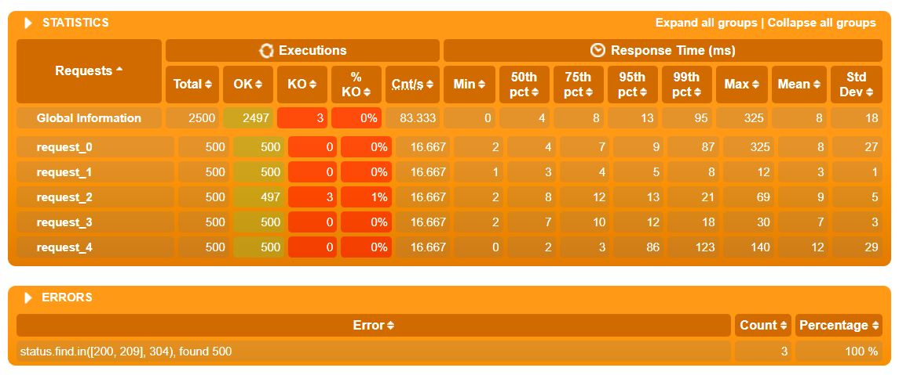

# aw10-final

## Report

### 功能

实现功能：

- pos-carts-购物车
  - /api/cart-查看购物车列表
  - /api/cart/add/{productId}-添加购物车
  - /api/cart/checkout-提交购物车
- pos-counter-运算
- pos-delivery-物流
  - /api/delivery/byid/{id}-获取物流信息
  - /api/delivery/byorder/{orderId}-获取订单物流信息
- pos-discovery-注册
- pos-gateway-网关
- pos-order-订单
  - /api/order-创建订单
  - /api/order/{id}-获取订单详情
- pos-products-商品
  - /api/products-获取商品列表
  - /api/products/{puoductId}-获取商品详情

### 测试

使用Gatling测试500个用户并发执行以下操作：

1. 获取商品列表
2. 获取商品详情
3. 查看购物车
4. 加入购物车
5. 再次查看购物车

从以上测试结果可以看出，使用cache后可以使非首次的查询响应更快，并且可以有效避免超时。服务器整体响应速度很快，效率较高。

### 架构

使用微服务架构，响应式架构可以帮助服务器有效提高响应时间，提高服务器效率。由于响应式架构的特点，系统采用消息驱动，降低了模块之间的耦合度，使得模块之间的通信自由度得到了提高。微服务架构赋予系统较高的可拓展性，与消息驱动共同保障了后续开发迭代的便利，也同时让系统具有一定的稳定性。
